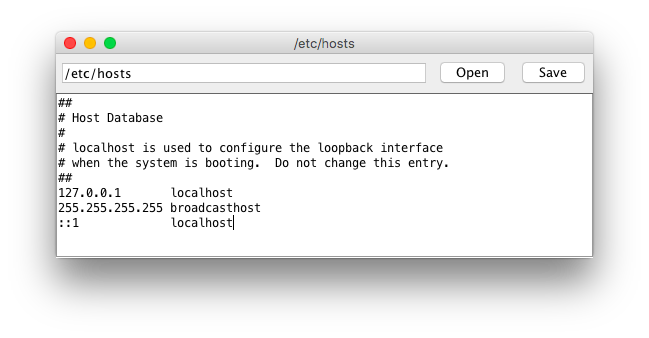

# TextEditor

A text editor written in Java.



## Build

```sh
javac -d out/production/texteditor/ -cp src src/com/texteditor/wf/TextEditor.java

```

## Run

```sh
java -cp out/production/texteditor/ com.texteditor.wf.TextEditor
```

You can also provide a the path to the file you want to read or edit as an argument:

```sh
java -cp out/production/texteditor/ com.texteditor.wf.TextEditor /path/to/text/file
```

## Usage
To open a text file, enter its path in the text field then click "Read". If the file exists, it will load its contents to the text area. Make any desired changes. To save your changes, click the "Write" button.